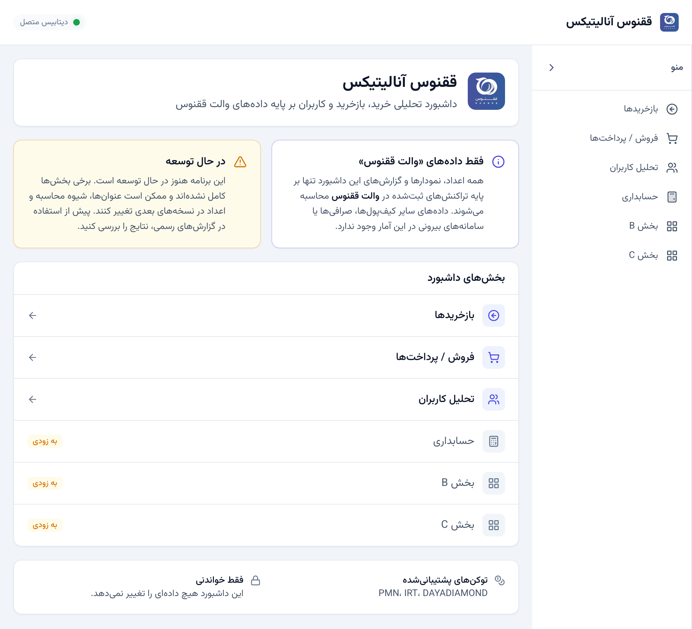

# Kuknos Analytics

Persian/RTL analytics dashboard for **Kuknos Wallet** token transactions. A read-only analytics
platform that connects to an existing PostgreSQL database, executes analytical queries, and displays
results through KPI cards and interactive charts.

> **Scope:** every figure in this dashboard is derived **only** from transactions recorded in Kuknos
> Wallet. Other wallets, exchanges and external systems are not represented in the data.
>
> **Status:** under active development. Some sections are placeholders, and labels/calculations may
> still change — verify results before using them in official reports.



## Features

- **Persian language & RTL** throughout — Vazirmatn font, Persian digits, Jalali dates
- **Multi-token** — every buys/refunds/users metric can be scoped to `PMN`, `IRT` or `DAYADIAMOND`
  via a dropdown; each KPI label and chart title names the selected token
- **31 API endpoints** across four routers, all accepting an optional date range
- **Three analytics sections**
  - فروش / پرداخت‌ها — Buy/payment analytics (11 endpoints, 6 KPIs)
  - بازخریدها — Refund analytics (9 endpoints, 9 KPIs)
  - تحلیل کاربران — User analytics (10 endpoints, 4 KPIs)
- **Charts** — line, area, bar, horizontal bar, donut and OHLC candlestick via Apache ECharts, with
  range zoom on the long daily series
- **Pending-refunds table** — paginated, per-column filtering, and Excel export
- **Responsive** — icon-collapsing sidebar on desktop, off-canvas drawer on mobile
- **Resilient** — one failing endpoint costs one chart, not the page; superseded requests are aborted

## Tech Stack

### Backend
- **Python 3.11+** with FastAPI
- **async SQLAlchemy** + asyncpg for PostgreSQL
- **NumPy** for the buy-fee calculation
- **Loguru** for structured logging
- **uv** for package management

### Frontend
- **React 18** with Vite
- **Tailwind CSS 3** — semantic design tokens as CSS variables
- **Apache ECharts** (`echarts-for-react`) for charts
- **React Router** for navigation
- **Axios** for API calls
- **jalaali-js** for Persian calendar support
- **react-multi-date-picker** for the Jalali range picker
- **lucide-react** for icons
- **xlsx** for Excel export

## Quick Start

### Prerequisites
- Python 3.11+
- Node.js 18+
- PostgreSQL database access
- uv installed (`curl -LsSf https://astral.sh/uv/install.sh | sh`)

### Installation

1. Clone the repository and navigate to the project directory

2. Configure environment variables:
   ```bash
   cp .env.example .env
   # Edit .env with your database credentials
   ```

3. Run the application:
   ```bash
   ./start.sh
   ```

This will:
- Fix npm permissions (if needed)
- Start the backend on `http://localhost:8000`
- Start the frontend on `http://localhost:5173`

### Accessing the Application

- **Frontend**: http://localhost:5173
- **API Documentation**: http://localhost:8000/docs
- **Health Check**: http://localhost:8000/health
- **DB Health Check**: http://localhost:8000/api/health/db

## Project Structure

```
kuknos-analytics/
├── backend/
│   ├── app/
│   │   ├── main.py           # FastAPI app
│   │   ├── config.py         # Settings
│   │   ├── database.py       # DB connection
│   │   ├── logger.py         # Logging setup
│   │   ├── routers/          # API endpoints
│   │   ├── services/         # Business logic + SQL
│   │   │   ├── token_utils.py  # Supported tokens, validation
│   │   │   └── date_utils.py    # Date-range filter builder
│   │   └── schemas/          # Pydantic models
│   └── pyproject.toml
│
├── frontend/
│   └── src/
│       ├── api/              # Axios client
│       ├── components/
│       │   ├── ui/           # Primitives: Card, Button, Field, Feedback…
│       │   └── …             # ChartCard, KPICard, filters, table, layout
│       ├── config/
│       │   └── navigation.js # Drives BOTH the sidebar and the router
│       ├── hooks/
│       │   └── useAnalytics.js # Parallel fetch, per-endpoint errors, abort
│       ├── pages/            # Home, Buys, Refunds, UserAnalytics, ComingSoon
│       ├── utils/            # formatters, chartTheme, dateRange, tokens, cn
│       ├── index.css         # Design tokens + Tailwind directives
│       ├── App.jsx           # Router
│       └── main.jsx          # Entry point
│
├── .env                      # Environment variables
├── start.sh                  # Startup script
└── CLAUDE.md                 # Architecture documentation (git-ignored, local only)
```

## Database Requirements

The application is **read-only** and expects an existing PostgreSQL database containing:

| Table | Used for |
|-------|----------|
| `pending_txes` | Token purchases (buys) |
| `pending_refunds` | Token sells / refunds |
| `federation`, `kuknos_user`, `identity` | Resolving a wallet to its account holder — the pending-refunds table and the top-buyer/seller tooltips |
| `market_parameters_minutes` | Price series for the PMN buy-fee calculation |

See `CLAUDE.md` for complete schema and query documentation.

## Development

### Backend Only
```bash
cd backend
uv run uvicorn app.main:app --reload
```

### Frontend Only
```bash
cd frontend
npm run dev
```

> **Restart the frontend dev server after editing `tailwind.config.js`.** Tailwind 3 + Vite does not
> reliably regenerate utilities on config changes, and can also miss brand-new class strings. The
> symptom looks like a CSS bug — the class is on the element but the rule was never emitted, so the
> element silently falls back. Confirm against the real output with
> `npm run build && grep -o '\.w-sidebar[^}]*}' dist/assets/*.css`.

### Adding Dependencies

**Backend:**
```bash
cd backend
uv add <package-name>
```

**Frontend:**
```bash
cd frontend
npm install <package-name>
```

## API Endpoints

All analytics endpoints accept optional `?start_date=YYYY-MM-DD&end_date=YYYY-MM-DD`, and an optional
`?token=` (one of `PMN`, `IRT`, `DAYADIAMOND`; defaults to `PMN`). An unsupported token returns 400.

### Buys / Payments (`/api/buys/*`)
- `/tokens` - Supported token codes + default
- `/kpis` - 6 KPI metrics (5 for tokens without a fee price series)
- `/total-fee` - Total buy fee, loaded separately (PMN only; 400 for other tokens)
- `/daily-count` - Daily purchase volume
- `/daily-volume` - Daily purchase volume in Rials
- `/monthly-trend` - Monthly aggregated data
- `/exchange-rate-trend` - Daily average exchange rate
- `/by-gateway` - Distribution by payment gateway
- `/by-application` - Distribution by app source
- `/status-distribution` - Transaction status breakdown
- `/amount-distribution` - Purchase amount histogram

### Refunds (`/api/refunds/*`)
- `/tokens` - Supported token codes + default
- `/kpis` - 9 KPI metrics
- `/daily-count` - Daily refund count
- `/monthly-trend` - Monthly refund trend
- `/rate-trend` - Daily average refund rate
- `/rate-candlestick` - Daily OHLC of the refund rate
- `/status-distribution` - Refund status breakdown
- `/by-bank` - Distribution by destination bank
- `/amount-distribution` - Refund amount histogram

### Users (`/api/users/*`)
- `/tokens` - Supported token codes + default
- `/kpis` - 4 KPI metrics: total unique (union), buyers, sellers, two-sided (intersection).
  These satisfy `buyers + sellers − two-sided = total`
- `/new-per-month` - New users per month
- `/top-buyers` - Top 10 buyers by volume, with account-holder name
- `/top-sellers` - Top 10 sellers by volume, with account-holder name
- `/activity-distribution` - User activity histogram
- `/monthly-active` - Monthly active users
- `/buy-sell-comparison` - Buy vs Sell monthly comparison
- `/pending-users` - Paginated pending-refunds table (`page`, `page_size`, per-column filters)
- `/pending-users/export` - Full pending-refunds export, no pagination

The `/pending-users` pair deliberately spans **all** tokens rather than following the page's token
dropdown — each row reports its own token and can be filtered per column.

### Health (`/api/health/*`)
- `/db` - Database connectivity, polled by the header status indicator

## Error Handling

The application handles connectivity issues gracefully:
- Backend returns 503 with a Persian `detail` message; every DB call is wrapped in try/except
- The frontend uses `Promise.allSettled`, so a single failing endpoint costs one chart rather than
  blanking the page; a page-level error is shown only when every endpoint fails
- Retry re-runs with the currently selected filters instead of reloading the page
- Filter changes abort superseded requests, so a slow earlier response cannot land last and win

## Architecture

For complete architectural documentation, conventions, design tokens and SQL queries, see
`CLAUDE.md`. Note that it is git-ignored, so it is present in local checkouts only.

## License

MIT

## Support

For issues or questions, please check the architecture documentation in `CLAUDE.md`.
